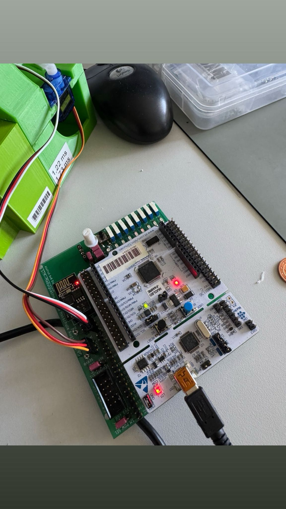

# Candy Dispenser/Machine STM32





A small candy dispenser controlled by an STM32 microcontroller.  
The dispenser releases candies when a coin is inserted or the button is pressed and shows the stock level with an RGB LED.

---

## 🔹 Function of the Dispenser

- The storage container holds chewing candies.
- After inserting a coin, it falls into a slider.
- A servo moves the slider forward, releasing a candy.
- The coin is directed to the collection tray.
- If no coin is in the slider, no candy is released.

- A light-dependent resistor (LDR) in the storage area detects the stock level.  
  If the stock is low, it can be detected by reading the ADC value.

---

## 🔹 Hardware Components

| Component           | Connection / Function                                  |
|--------------------|--------------------------------------------------------|
| Servo              | Timer 3, Channel 0 – moves the slider                |
| RGB LED            | Timer 3, Channels 1–3 – indicates operation and stock |
| Button             | GPIO Port C12, active-low – triggers candy release   |
| Stock Sensor       | ADC Channel 1 – light-dependent resistor             |

---

## 🔹 Servo Control

- The servo moves within a limited range (min/max pulse width as constants).
- Movement to the release position and back occurs **gradually**, not abruptly, to protect the mechanics.
- At least 100 steps with short delays in between.

---

## 🔹 Stock Level Detection

- Sensor connected to ADC via voltage divider.
- High ADC value → candy present  
- Low ADC value → stock low/empty
- Threshold depends on ambient light.
- Limited number of releases when “low stock” until full again.

---

## 🔹 Process Flow

1. Servo in resting position
2. Button pressed → servo moves forward → candy released → servo returns
3. RGB LED shows status in parallel:
   - **Green:** stock OK  
   - **Red:** stock low  
   - **Blue:** servo moving

---

## 🔹 RGB LED Indication

| Status                  | Color |
|-------------------------|-------|
| Stock sufficient        | Green |
| Stock low               | Red   |
| Servo in motion         | Blue  |

---

## 🔹 Installation / Usage

1. Clone the repository:
```bash
git clone https://github.com/username/candy-dispenser.git